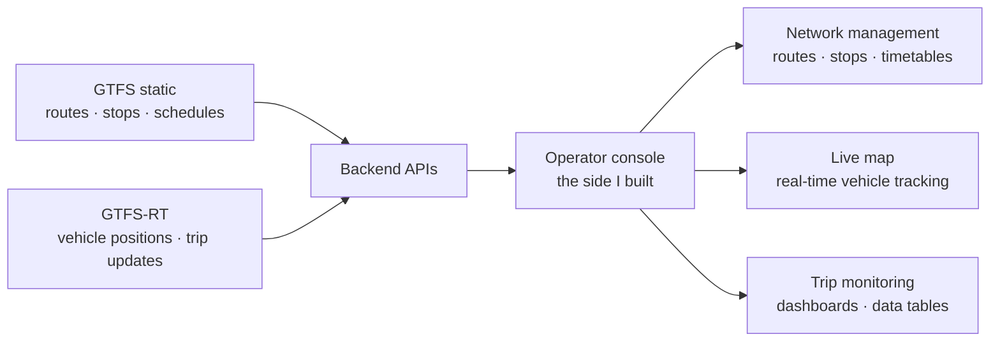

**Information Technology Engineering** at Damascus University (2020–2026), specialising in Software Engineering and Information Systems — and a full-stack developer at **90soft**.

I work across the stack, but the work I care about sits underneath the screen: a compiler carried through to code generation, a hybrid search engine over more than 740,000 documents, a three-node Raft cluster, an ERP written as real Odoo modules, and a GTFS-compliant transit platform for Damascus that is being prepared for a public launch.

Al-Abasien, Damascus, Syria · Arabic — native · English — fluent

> [!TIP]
> The fastest way to judge the work is to look at it — **[wesam-soulaiman.github.io](https://wesam-soulaiman.github.io/)**, live right now.

---

## Now

**90soft — Full-Stack Developer, and Software Engineer & Technical Recruiter.** 2026 — present

Two roles, on purpose. I build **Code Your Future**, a platform that evaluates candidates on real tasks instead of CV keywords: Angular on the front, Parse Server behind it — cloud functions, data classes, queries, authentication, role-based permissions. Then I go and do the hiring myself: scoping roles with team leads, writing the job descriptions, technically screening engineers, running interview loops through offer and onboarding. Writing the tool and using the tool in the same week is a very short feedback loop, and the product is better for it.

**Darb — Public Transit Information System.** with Zajil Transport Company · 2024 — present

My graduation project: a GTFS / GTFS-RT compliant transit information system for Damascus — routes, schedules, stops, trip monitoring and real-time vehicle tracking, now being prepared for a public launch. I built the operator-facing side, and integrated every one of those screens with the backend APIs.

> [!NOTE]
> Darb has no public repository — it is launching with its partner company. The diagram is the shape of it; I am happy to walk through the operator screens in an interview.

---

## Selected work

Indexed by what it demonstrates, not by what the repository is called.

| Domain | Project | What it is |
| :--- | :--- | :--- |
| **Backend & APIs** | [**Optical-Shop-Project**](https://github.com/Wesam-Soulaiman/Optical-Shop-Project) Python · Django REST · MySQL | A Django REST Framework backend for an eyewear e-commerce platform: 24 models and 22 endpoints across catalogue, carts, favourites, orders, customer prescriptions, wallets and store locations — JWT auth on a custom user model, nested routers, filtering, search and pagination. |
| **Compilers** | [**Angular-Compiler-Code-Generation**](https://github.com/Wesam-Soulaiman/Angular-Compiler-Code-Generation) Java | A compiler for Angular templates and CSS: ANTLR lexer and parser, a visitor that builds a typed AST, a symbol table with semantic error checks, and a code generator that emits runnable HTML, CSS and JavaScript. |
| **Information retrieval** | [**ir-search-engine**](https://github.com/Wesam-Soulaiman/ir-search-engine) Python · Django REST · React | A search engine over 500,000+ Quora and 240,000+ clinical-trial documents: TF-IDF, BM25 and dense retrieval (Sentence Transformers + FAISS), hybrid ranking with reciprocal rank fusion, sharded BM25, learning-to-rank reranking — measured with MAP, nDCG@10, Precision@10 and Recall. |
| **ERP / Odoo** | [**smart-hospital-odoo**](https://github.com/Wesam-Soulaiman/smart-hospital-odoo) Python · Odoo 17 · Docker | A Smart Mobile Hospital ERP as custom Odoo modules — Python logic, XML and QWeb views and reports — covering emergency triage, IoT monitoring, fleet, inventory, procurement and recruitment. Odoo is self-taught. |
| **Distributed systems & security** | [**secure-distributed-system**](https://github.com/Wesam-Soulaiman/secure-distributed-system) Node.js · React · Nginx · Docker | A three-node Raft cluster — leader election, log replication, majority commits, failover — behind a custom load balancer (weighted round robin, consistent hashing), circuit breakers with exponential-backoff retry, and an Nginx gateway with a WAF and rate limiting. A dashboard lets you fail the leader and watch the election. |
| **AI & search algorithms** | [**Stacked-Game**](https://github.com/Wesam-Soulaiman/Stacked-Game) · [**Ludo-Game**](https://github.com/Wesam-Soulaiman/Ludo-Game) Java | A Swing puzzle game set against BFS, DFS, UCS, Hill Climbing and A\*, so the trade-offs between them stop being theoretical — and a console Ludo whose bots plan under dice uncertainty with Expectiminimax. |
| **Design patterns & OOD** | [**advanced-banking-system**](https://github.com/Wesam-Soulaiman/advanced-banking-system) Java · Spring Boot · PostgreSQL | A layered Spring Boot banking API (Spring Security + JWT, JPA, WebSockets) whose domain is built from design patterns: State for the account lifecycle, Strategy for interest, Decorator for overdraft and premium features, Composite for account groups, Chain of Responsibility for the transaction pipeline, Observer for domain events, plus Adapter and Facade. |
| **Full-stack products** | [**Spotify-Full-Stack**](https://github.com/Wesam-Soulaiman/Spotify-Full-Stack) · [**Chat**](https://github.com/Wesam-Soulaiman/Chat) React · Vite · Node · MongoDB | Music streaming with a listener client, an admin dashboard for the catalogue and a Cloudinary media pipeline — and real-time messaging on Socket.IO with JWT auth and a multilingual UI. |
| **Angular + Parse Server** | [**candidate-tracker**](https://github.com/Wesam-Soulaiman/candidate-tracker) TypeScript | A candidate tracker on Angular and Parse Server — my first project on the stack I now use to build Code Your Future. |

<b>Four more repositories on this profile</b>

 

| Repository | Language |
| :--- | :--- |
| [Angular-Compiler](https://github.com/Wesam-Soulaiman/Angular-Compiler) — the same compiler before its code-generation stage | Java |
| [MERN-auth](https://github.com/Wesam-Soulaiman/MERN-auth) — MERN authentication: email verification, password reset, bcrypt, JWT in httpOnly cookies | JavaScript |
| [Cars-Front-Dashboard](https://github.com/Wesam-Soulaiman/Cars-Front-Dashboard) | JavaScript |
| [Cars-Front-Website](https://github.com/Wesam-Soulaiman/Cars-Front-Website) | HTML |

---

## Stack

<b>Frontend</b>

<picture>
  <source media="(prefers-color-scheme: dark)" srcset="https://skillicons.dev/icons?i=angular,react,vue,ts,js,tailwind,materialui,vite&theme=dark">
  
</picture>

<b>Backend and data</b>

<picture>
  <source media="(prefers-color-scheme: dark)" srcset="https://skillicons.dev/icons?i=nodejs,express,django,python,java,postgres,mysql,mongodb&theme=dark">
  
</picture>

<b>Platform</b>

<picture>
  <source media="(prefers-color-scheme: dark)" srcset="https://skillicons.dev/icons?i=docker,linux,git&theme=dark">
  
</picture>

| Layer | What I work with |
| :--- | :--- |
| **Software engineering** | Requirements analysis · object-oriented design · data structures and algorithms · relational and document data modelling · REST API design · system integration |
| **Frontend** | React · Angular · Vue · Vite · Tailwind CSS · Material UI · responsive component-based interfaces · state management · Arabic RTL support |
| **Backend** | Node.js · Express.js · Django REST Framework · Parse Server · REST APIs · authentication and role-based permissions · WebSockets and real-time |
| **Databases** | Oracle · PostgreSQL · MySQL · MongoDB |
| **ERP / Odoo** | Custom Python modules · XML and QWeb views and reports · module configuration — self-taught through a training project |
| **Platforms and tools** | Linux servers and application deployment · Git · Docker |

---

## Background

**Damascus University** — B.Eng, Information Technology Engineering, 2020–2026. Specialised in Software Engineering and Information Systems.

**Syrian Virtual University** — B.Sc, Management, 2024–present. Specialised in Human Resources.

**Freelancer — Frontend Developer, 2023.** React.js with Material UI and Tailwind CSS: maintained and improved existing applications, and delivered frontend and full-stack features for clients.

The management degree is not a detour. Half of my job is judging engineers and building the thing that judges engineers, and doing that honestly turns out to be its own discipline.

---

## Contact

**Open to software engineering roles** — full-stack, backend or frontend.

**[Portfolio](https://wesam-soulaiman.github.io/)** · **[LinkedIn](https://www.linkedin.com/in/wesam-soulaiman/)** · **[wesamsoulaiman@gmail.com](mailto:wesamsoulaiman@gmail.com)** · **[+963 952 367 001](tel:+963952367001)** · Al-Abasien, Damascus, Syria

Email is the fastest way to reach me — I answer in Arabic or English.

